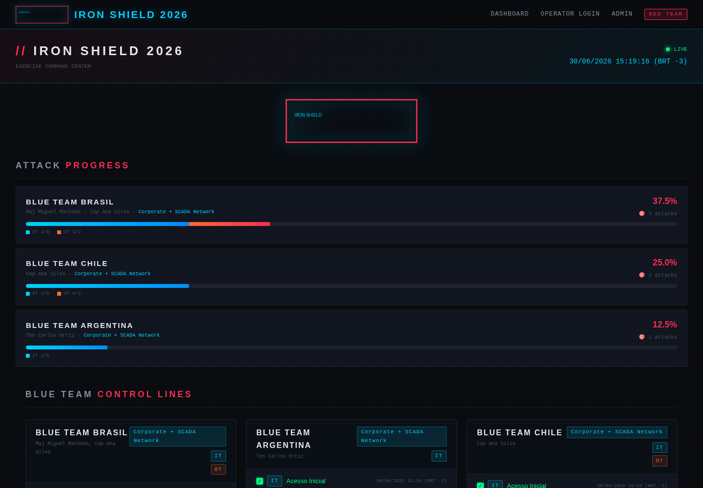
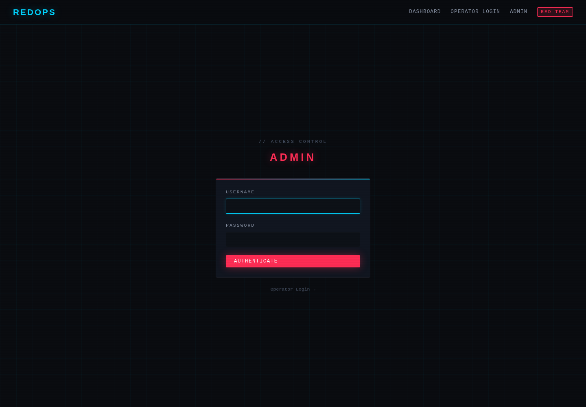
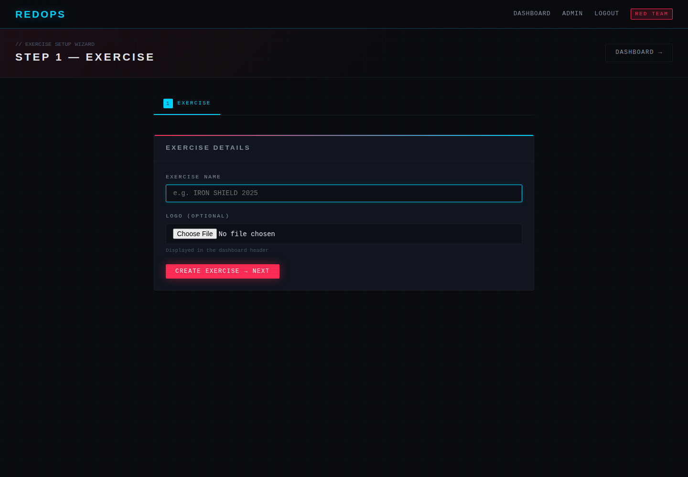
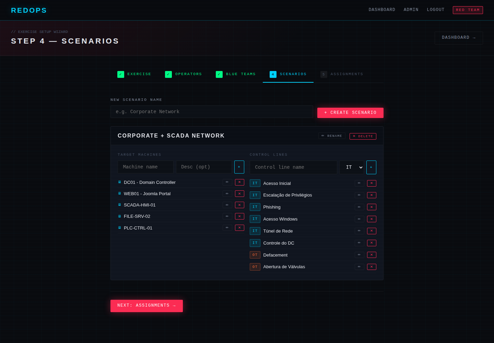
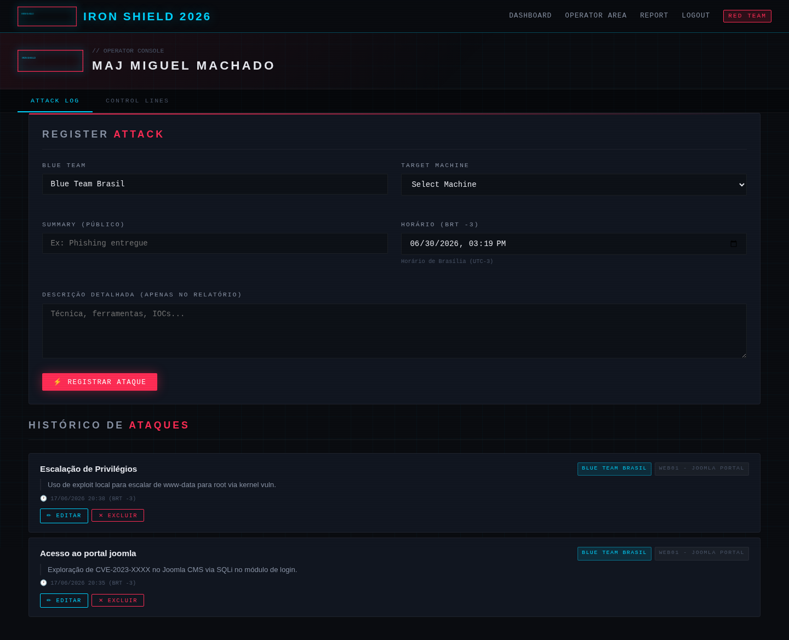
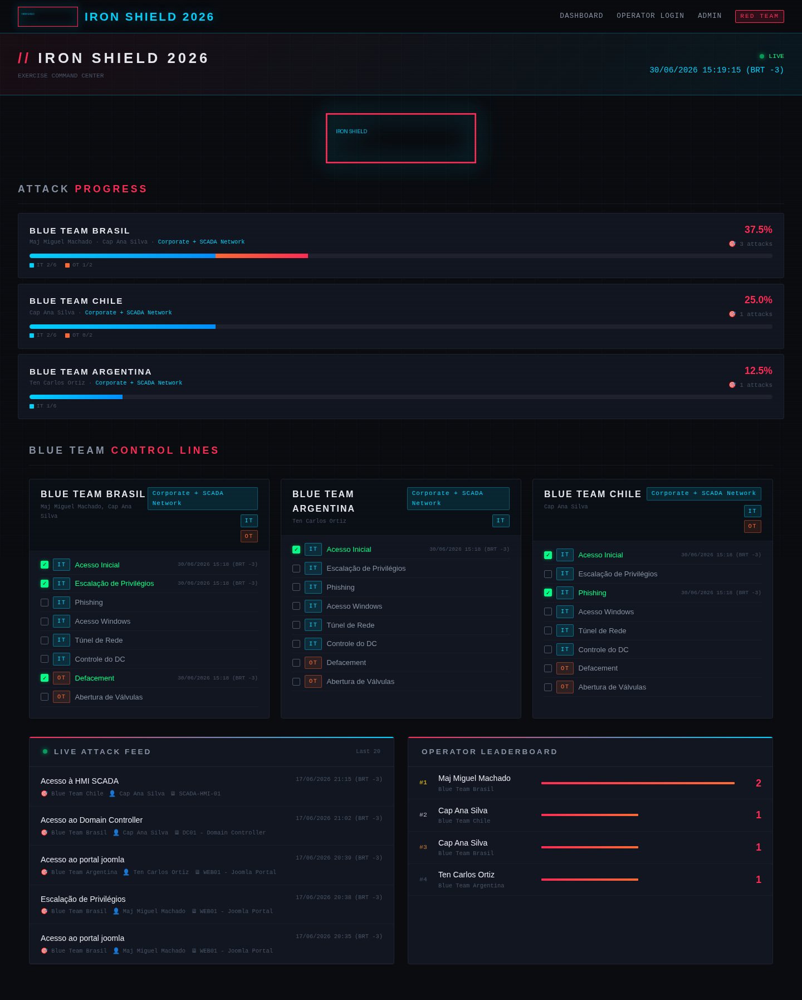
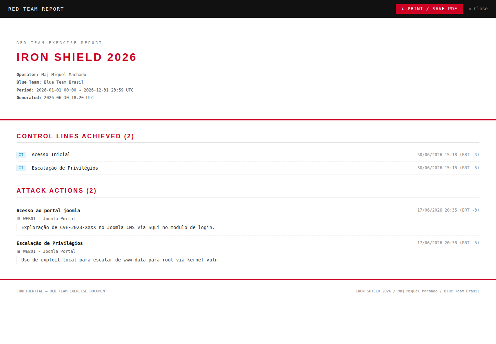

# REDOPS — Red Team Exercise Management Platform

<p align="center">
  
</p>

> An internal platform for managing Red Team exercises. Visually inspired by HackTheBox and TryHackMe.

---

## Features

- **Guided 5-step setup wizard**: exercise → operators → Blue Teams → scenarios → assignments
- **Reusable scenarios** with target machines and IT/OT control lines
- **Real-time public dashboard** (5s polling) showing combined IT+OT progress per Blue Team
- **Operator area** for logging attacks and toggling control lines via AJAX (no page reload)
- **Leaderboard** ranking operators by number of actions
- **PDF reports** per operator with a configurable time window
- **Full exercise report**, auto-generated when the exercise is closed
- **Brasília timezone (BRT -3)** applied to all timestamps
- **Cyberpunk-themed UI** with a dark color scheme and monospace/display fonts

---

## Stack

| Layer | Technology |
|---|---|
| Backend | Python 3.12, Flask 3.0 |
| ORM | SQLAlchemy 2.0 (classical mapping) |
| Database | SQLite (default) / PostgreSQL-compatible |
| Frontend | Jinja2 + plain CSS + vanilla JavaScript |
| Testing | Pytest + FakeUnitOfWork |

---

## Prerequisites

- **Python 3.10 or higher** ([download](https://www.python.org/downloads/))
- **pip** (bundled with Python)
- **git** (to clone the repository)

Check what you already have installed:

```bash
python3 --version
pip3 --version
```

---

## Installation

### 1. Clone the repository

```bash
git clone https://github.com/miguelsmachado/redops.git
cd redops
```

### 2. Create a virtual environment

```bash
python3 -m venv venv
```

### 3. Activate the virtual environment

**Linux / macOS:**
```bash
source venv/bin/activate
```

**Windows (cmd):**
```cmd
venv\Scripts\activate.bat
```

**Windows (PowerShell):**
```powershell
venv\Scripts\Activate.ps1
```

Once activated, you'll see `(venv)` at the start of your terminal prompt.

### 4. Install dependencies

```bash
pip install -r requirements.txt
```

### 5. Configure environment variables (optional)

The project runs with sensible defaults, but you can customize them:

**Linux / macOS:**
```bash
export DATABASE_URL=sqlite:///redteam.db
export SECRET_KEY=change-this-in-production
export ADMIN_USERNAME=admin
export ADMIN_PASSWORD=admin123
```

**Windows (cmd):**
```cmd
set DATABASE_URL=sqlite:///redteam.db
set SECRET_KEY=change-this-in-production
set ADMIN_USERNAME=admin
set ADMIN_PASSWORD=admin123
```

**Windows (PowerShell):**
```powershell
$env:DATABASE_URL="sqlite:///redteam.db"
$env:SECRET_KEY="change-this-in-production"
$env:ADMIN_USERNAME="admin"
$env:ADMIN_PASSWORD="admin123"
```

> If you skip this step, the system falls back to default values automatically (`admin` / `admin123`).

### 6. Run the server

```bash
python wsgi.py
```

You should see something like:
```
 * Running on http://0.0.0.0:5000
```

### 7. Open it in your browser

```
http://localhost:5000
```

---

## Environment variables

| Variable | Default | Description |
|---|---|---|
| `DATABASE_URL` | `sqlite:///redteam.db` | Database connection URL |
| `SECRET_KEY` | `dev-secret-change-in-prod` | Flask secret key (sessions) |
| `ADMIN_USERNAME` | `admin` | Administrator username |
| `ADMIN_PASSWORD` | `admin123` | **Change this before real use!** |
| `PORT` | `5000` | Port the dev server listens on |

---

## Stopping the server

In the terminal where it's running, press:
```
Ctrl + C
```

To exit the virtual environment:
```bash
deactivate
```

---

## Running it again later

You don't need to repeat the full install — just activate the venv and run:

```bash
cd redops
source venv/bin/activate    # Linux/Mac
# venv\Scripts\activate.bat   # Windows cmd

python wsgi.py
```

---

## Architecture

Built following patterns from *Architecture Patterns with Python* (Percival & Gregory):

```
src/
├── domain/
│   ├── model.py          # Entities, Value Objects, domain events
│   └── ports.py          # Abstract repository interfaces
├── adapters/
│   ├── orm/
│   │   └── mappings.py   # Classical SQLAlchemy mapping (ORM depends on the model)
│   └── repository/
│       └── sqlalchemy_repos.py
├── service_layer/
│   ├── services.py       # All use cases (works only with primitives)
│   └── unit_of_work.py   # Abstract UoW + SQLAlchemy + Fake (for tests)
└── entrypoints/
    └── flask_app.py      # Flask blueprints (HTTP → service calls)
```

### Principles applied

- **Dependency inversion**: the ORM depends on the domain model, never the other way around
- **Aggregate root**: `Exercise` is the root aggregate — every mutation goes through it
- **Repository pattern**: the service layer never touches SQLAlchemy directly
- **Unit of Work**: coordinates repositories and guarantees atomicity
- **Fake UoW**: unit tests run without a database
- **Domain events**: `AttackRegistered`, `ControlLineAchieved`, `ExerciseClosed`, etc.

---

## Usage guide

### 1. First login — Admin

Go to `http://localhost:5000/admin` and log in with your configured credentials (default: `admin` / `admin123`).

On first login, if there's no active exercise yet, you're automatically redirected to the setup wizard.

<p align="center">
  
</p>

---

### 2. Setup wizard (5 steps)

#### Step 1 — Exercise
Set the exercise name and upload a logo (shown on the dashboard).

<p align="center">
  
</p>

#### Step 2 — Operators
Create Red Team operator accounts (username + password).

#### Step 3 — Blue Teams
Create defending teams. Mark which domains apply (IT and/or OT/SCADA).

#### Step 4 — Scenarios
Build scenarios with:
- **Target machines** (e.g. DC01, SCADA-HMI-01)
- **IT control lines** (e.g. Phishing email delivered, Initial access obtained)
- **OT control lines** (e.g. OT network access, Valve actuation)

The same scenario can be assigned to multiple Blue Teams — progress is tracked independently per team.

<p align="center">
  
</p>

#### Step 5 — Assignments
- Check which operators are assigned to each Blue Team (matrix view)
- Select which scenario each Blue Team uses

---

### 3. Operator area

Go to `http://localhost:5000/operator` and log in with the credentials created by the admin.

<p align="center">
  
</p>

#### Logging an attack
Fill in:
- Target Blue Team (if assigned to more than one)
- Target machine (from that BT's scenario)
- Public summary (shown in the dashboard feed)
- Detailed description (shown only in reports)
- Timestamp (BRT -3, auto-filled)

#### Marking control lines
On the **Control Lines** tab, use the toggle to mark/unmark each line as achieved.
This happens via AJAX — **the page never reloads**.

---

### 4. Public dashboard

Go to `http://localhost:5000` — no login required.

<p align="center">
  
</p>

Shows:
- The exercise **logo**, prominently displayed
- **Progress bars** per Blue Team: a single continuous bar split into a blue (IT) and red (OT) segment, sorted by overall progress
- **Control line details** per Blue Team
- **Live attack feed** — last 20 attacks, refreshing every 5 seconds
- **Leaderboard** ranking operators by number of actions

---

### 5. Operator report

Go to `http://localhost:5000/operator/report`.

Pick the Blue Team and time window → click **Generate PDF Report**.

On the generated page, use `Ctrl+P` → "Save as PDF".

<p align="center">
  
</p>

---

### 6. Closing the exercise

From the admin panel → **Close Exercise**.

The dashboard freezes in its final state, and the full report becomes available at `/admin/report/<exercise_id>`.

---

## Tests

```bash
# With the virtual environment active
pip install pytest
python -m pytest tests/unit/ -v
```

Expected result: **28 passed**

Unit tests use `FakeUnitOfWork` — no database is needed to run them.

---

## Running with Docker (alternative)

Docker support is also included if you prefer it:

```bash
docker-compose up --build
# Visit http://localhost:7331
```

The recommended path for development and everyday use, however, is the Python virtual environment described above.

---

## Project structure

```
redops/
├── src/
│   ├── domain/
│   │   ├── model.py              # Pure domain logic
│   │   └── ports.py              # Interfaces
│   ├── adapters/
│   │   ├── orm/mappings.py       # Classical SQLAlchemy ORM mapping
│   │   └── repository/           # Concrete implementations
│   ├── service_layer/
│   │   ├── services.py           # Use cases
│   │   └── unit_of_work.py       # UoW + Fake
│   └── entrypoints/
│       └── flask_app.py          # Flask + Blueprints
├── templates/
│   ├── base.html
│   ├── dashboard/
│   ├── operator/
│   ├── admin/
│   │   └── wizard/               # Steps 1-5
│   └── reports/
├── static/
│   ├── css/
│   └── img/                      # Uploaded logos (not versioned)
├── tests/
│   └── unit/
│       ├── test_domain_model.py
│       └── test_services.py
├── requirements.txt
├── wsgi.py
├── Dockerfile                    # Optional
├── docker-compose.yml            # Optional
└── README.md
```

---

## Architectural reference

This project implements the patterns described in:

> **Architecture Patterns with Python**
> Harry Percival & Bob Gregory — O'Reilly, 2020
> [https://www.cosmicpython.com](https://www.cosmicpython.com)

Chapters applied:
- Ch. 1: Domain Modeling
- Ch. 2: Repository Pattern
- Ch. 4: Service Layer
- Ch. 5: TDD (High Gear and Low Gear)
- Ch. 6: Unit of Work
- Ch. 7: Aggregates

---

## Troubleshooting

**`python3` is not recognized (Windows)**
Use `python` instead of `python3`.

**Permission error activating venv (PowerShell)**
```powershell
Set-ExecutionPolicy -ExecutionPolicy RemoteSigned -Scope CurrentUser
```

**Port 5000 already in use**
```bash
export PORT=8080  # or any free port
python wsgi.py
```

---
